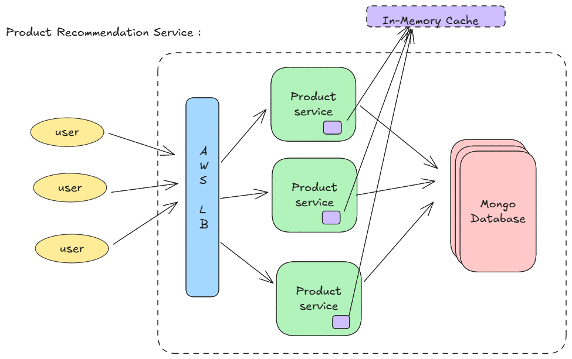

# Product Recommendation Service — Backend (Spring Boot 3, Java 17)

This project is a lightweight backend service that provides product metadata and recommendation APIs.  
It demonstrates a clean, modular architecture using **Spring Boot**, **MongoDB**, and multiple **caching strategies** (key-based, type-based, and composite-key).

---

## Architecture diagram(High-Level)



## Architecture Overview

```
spring-backend/
### src/main/java/com/example/backend
###### ProductRecommendationServiceApplication.java
######### controller/           # REST endpoints
######### service/              # Business logic
######### repository/           # MongoDB repositories
######### cache/                # Cache strategies (LRU-based)
######### config/               # Bean configurations
######### model/                # Domain models
######### dto/                  # dto
######### util/                 # uril
######### src/test/java/...     # Unit & integration tests
```

## ⚙️ Core Components

### 1️⃣ Product Entity

```java
@Document(collection = "products")
public record Product(
    @Id String id,
    String name,
    String type,
    String category,
    long price,
    String recommendedAgeGroup,
    Map<String, String> attributes
) {}
```

A simple immutable `record` representing a product.  
Using `record` ensures automatic constructor, getters, and equals/hashCode — perfect for DTO-like objects.

---

### 2️⃣ Repository Layer

```java
public interface ProductRepository extends MongoRepository<Product, String> {
    List<Product> findByType(String type);
}
```

Spring Data MongoDB automatically implements this interface.

**Design choice:**  
We rely on Spring Boot’s built-in auto-configuration (no manual `MongoConfig` class).  
Mongo connection properties are defined in `application.yml`.

---

### 3️⃣ Service Layer

`ProductServiceImpl` handles fetching, filtering, and caching products.

```java
public class ProductServiceImpl implements ProductService {
    private final ProductRepository productRepository;
    private final CacheStrategy<String, Product> productCache;
    private final CacheStrategy<String, List<Product>> recommendationCache;
}
```

**Logic:**
- Fetch product by ID or type.
- Cache results (in `productCache` or `recommendationCache`).
- For recommendations, build a **composite key** based on filters:

```java
String key = String.format(
    "min=%s|max=%s|type=%s|cat=%s|age=%s",
    f.minPrice(), f.maxPrice(), f.type(), f.category(), f.age()
);
```

---

### 4️⃣ Cache Layer (LRU Implementations)

Three variants of `CacheStrategy<K, V>` exist:

- **KeyBasedLRUCache** - Product cache keyed by product ID
- **TypeBasedLRUCache** - Cache keyed by `"TYPE::<type>"`
- **CompositeKeyRecommendationCache** - Caches filtered recommendation results

All use access-order `LinkedHashMap` for O(1) reads/writes and automatic eviction.

---

### 5️⃣ MongoDB Integration

No explicit `MongoConfig` — Spring Boot autoconfigures it via `application.yml`:

```yaml
spring:
  data:
    mongodb:
      uri: mongodb://localhost:27017/products
      database: productdb
```

For tests, we can use:
- **Testcontainers MongoDB** (preferred for modern Spring Boot).

---

### 6️⃣ Testing Strategy

#### ✅ Unit Tests
- Mock repositories and caches with Mockito.
- Verify LRU behavior, caching calls, and filtering logic.

#### ✅ Integration Tests
- Use `@SpringBootTest` + `@AutoConfigureMockMvc` to verify full API behavior.
- Activate `application-test.yml` profile (can use embedded or mock Mongo).

---
